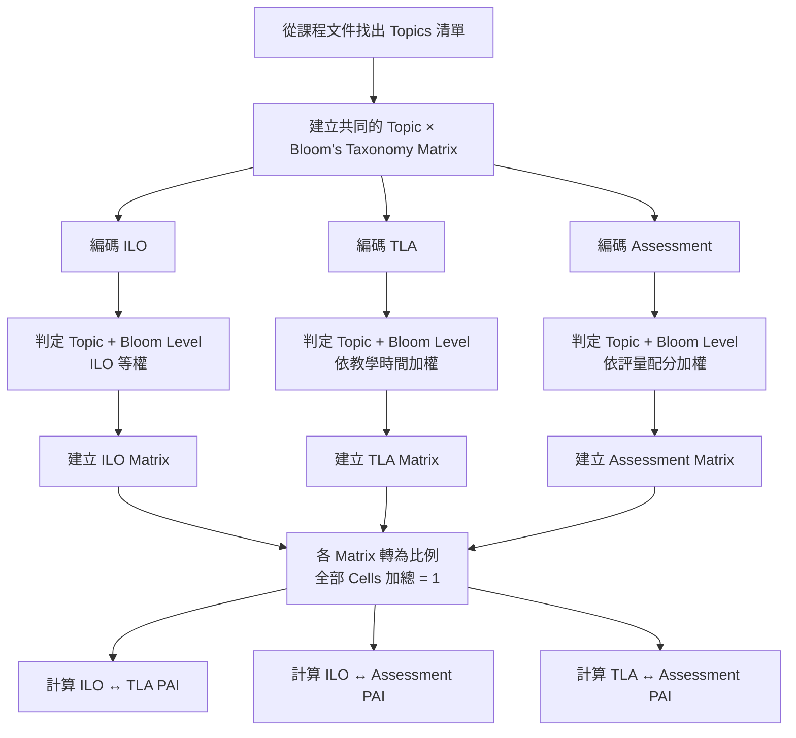

---
{"dg-publish":true,"permalink":"/Porter's alignment index/","title":"Porter's alignment index","tags":["agreement","education","measurement"],"created":"2026-09-15T11:29","updated":"2026-09-15T11:39","dg-note-properties":{"date":"2026-09-15T11:29","lastmod":"2026-09-15T11:39","aliases":null,"tags":["agreement","education","measurement"],"title":"Porter's alignment index"}}
---

# Porter’s Alignment Index：從 Topic × Bloom Matrix 到 Alignment 的計算方式

Porter’s Alignment Index（PAI）用來衡量兩個課程構面之間的一致程度。它不是直接問「有沒有對應」，而是先把課程內容整理成相同結構的矩陣，再比較兩個矩陣中每一個 cell 的比例是否接近。

Porter 的原始方法以「content matrix of proportions」表示課程內容的相對強調程度，並逐 cell 比較兩個矩陣。CAAP 延續這個概念，把 ULO／ILO、TLA 與 Assessment 分別建立成結構相同的矩陣，再計算三者之間的 alignment。

> **說明：** Sims發展的 CAAP 使用 SOLO Taxonomy 作為 cognitive-demand dimension。以下為了示範，改用 Revised Bloom’s Taxonomy 的 Remember、Understand、Apply、Analyze、Evaluate、Create。改變的是矩陣的認知層次欄位，Porter’s Alignment Index 的計算原理不變。CAAP 原文的矩陣是以 content topics 為 rows、SOLO levels 為 columns。

## 整體流程

計算前，第一步不是直接處理 ILO，而是先從課程文件中整理出一套共同的 **topics 清單**。CAAP 的做法是由課程文件歸納 content topics，再讓 ILO、TLA 與 Assessment 都使用同一套 topic 分類。

---

## 1. 先建立 Topic × Bloom’s Taxonomy Matrix

假設這門課已經整理出四個 topics：

- Topic A
- Topic B
- Topic C
- Topic D

使用 Revised Bloom’s Taxonomy 後，共有六個 cognitive-demand levels，因此矩陣會長成：

| Content Topic | Remember | Understand | Apply | Analyze | Evaluate | Create |
|---|---:|---:|---:|---:|---:|---:|
| Topic A |  |  |  |  |  |  |
| Topic B |  |  |  |  |  |  |
| Topic C |  |  |  |  |  |  |
| Topic D |  |  |  |  |  |  |

每一個交叉位置就是一個 **cell**。

例如：

- `Topic A × Remember` 是一個 cell
- `Topic A × Understand` 是另一個 cell
- `Topic A × Evaluate` 又是另一個 cell

因此，4 個 topics × 6 個 Bloom levels，總共有：

$$
4\times6=24\text{ cells}
$$

ILO、TLA 與 Assessment 都使用這 **24 個完全相同的位置**。這一點很重要，因為之後的 alignment 就是逐 cell 比較。

---

## 2. 建立 ILO Matrix

假設這門課有 5 個可分類的 ILO：

| ILO | Topic | Bloom level |
|---|---|---|
| ILO 1 | Topic A | Remember |
| ILO 2 | Topic A | Understand |
| ILO 3 | Topic A | Evaluate |
| ILO 4 | Topic B | Apply |
| ILO 5 | Topic C | Analyze |

CAAP 對 ULO／ILO 採 **等權**處理。也就是說，如果共有 5 個 ILO，每個 ILO 的權重為：

$$
\frac{1}{5}=.20
$$

因此 ILO 1 位於 `Topic A × Remember`，就在該 cell 放入 `.20`；ILO 2 位於 `Topic A × Understand`，就在該 cell 放入 `.20`，以此類推。

### ILO Matrix

| Content Topic | Remember | Understand | Apply | Analyze | Evaluate | Create | Total |
|---|---:|---:|---:|---:|---:|---:|---:|
| Topic A | .20 | .20 | 0 | 0 | .20 | 0 | .60 |
| Topic B | 0 | 0 | .20 | 0 | 0 | 0 | .20 |
| Topic C | 0 | 0 | 0 | .20 | 0 | 0 | .20 |
| Topic D | 0 | 0 | 0 | 0 | 0 | 0 | 0 |
| **Total** | **.20** | **.20** | **.20** | **.20** | **.20** | **0** | **1.00** |

這張表表示的是：

> 課程在 ILO 中宣稱學生應達成的「內容 × 認知要求」分布。

---

## 3. 建立 TLA Matrix

TLA 的處理方式不同。CAAP 不是把每一個 learning activity 算成一票，而是依活動所占的 **contact hours** 加權。

假設整門課目前分析到的教學時間為 10 小時：

| TLA | Topic | Bloom level | 時數 |
|---|---|---|---:|
| TLA 1 | Topic A | Remember | 2 |
| TLA 2 | Topic A | Understand | 2 |
| TLA 3 | Topic B | Apply | 2 |
| TLA 4 | Topic C | Analyze | 2 |
| TLA 5 | Topic D | Understand | 2 |

總教學時間：

$$
10\text{ 小時}
$$

因此每一項的比例都是：

$$
\frac{2}{10}=.20
$$

### TLA Matrix

| Content Topic | Remember | Understand | Apply | Analyze | Evaluate | Create | Total |
|---|---:|---:|---:|---:|---:|---:|---:|
| Topic A | .20 | .20 | 0 | 0 | 0 | 0 | .40 |
| Topic B | 0 | 0 | .20 | 0 | 0 | 0 | .20 |
| Topic C | 0 | 0 | 0 | .20 | 0 | 0 | .20 |
| Topic D | 0 | .20 | 0 | 0 | 0 | 0 | .20 |
| **Total** | **.20** | **.40** | **.20** | **.20** | **0** | **0** | **1.00** |

現在已經可以直接看出兩個差異：

- ILO 有 `Topic A × Evaluate = .20`，但 TLA 沒有。
- TLA 有 `Topic D × Understand = .20`，但 ILO 沒有。

這兩個位置之後都會降低 ILO–TLA 的 Alignment Index。

---

## 4. 建立 Assessment Matrix

Assessment 在 CAAP 中依 **mark allocation，也就是配分占總成績的比例**加權。

假設評量總分為 100 分：

| Assessment component | Topic | Bloom level | 配分 |
|---|---|---|---:|
| A1 | Topic A | Remember | 10 |
| A2 | Topic A | Understand | 10 |
| A3 | Topic A | Evaluate | 10 |
| A4 | Topic B | Apply | 20 |
| A5 | Topic C | Analyze | 30 |
| A6 | Topic D | Understand | 20 |

例如 A1 的權重為：

$$
\frac{10}{100}=.10
$$

A5 則是：

$$
\frac{30}{100}=.30
$$

### Assessment Matrix

| Content Topic | Remember | Understand | Apply | Analyze | Evaluate | Create | Total |
|---|---:|---:|---:|---:|---:|---:|---:|
| Topic A | .10 | .10 | 0 | 0 | .10 | 0 | .30 |
| Topic B | 0 | 0 | .20 | 0 | 0 | 0 | .20 |
| Topic C | 0 | 0 | 0 | .30 | 0 | 0 | .30 |
| Topic D | 0 | .20 | 0 | 0 | 0 | 0 | .20 |
| **Total** | **.10** | **.30** | **.20** | **.30** | **.10** | **0** | **1.00** |

到這一步，三張 matrix 都已經完成，而且每一張所有 cells 的比例總和都是：

$$
1.00
$$

這正是 Porter 方法進行比較前需要的形式。CAAP 也是先累積各 cell 的權重，再除以總權重，使整個矩陣成為總和為 1 的 proportion matrix。

---

## 5. Porter’s Alignment Index 怎麼算？

Porter’s Alignment Index 的公式為：

$$
PAI
=
1-\frac{1}{2}
\sum_{i=1}^{n}|X_i-Y_i|
$$

其中：

- \(X_i\)：第一張 matrix 的第 \(i\) 個 cell
- \(Y_i\)：第二張 matrix 同一位置的 cell
- \(n\)：全部 cells 的數量

Porter 的原始說明強調，alignment 衡量的是兩個 proportion matrices 的分布模式是否相似；概念上也可以理解成所有 cells 的 **cell-by-cell intersects** 加總。指數範圍為 0 到 1，越接近 1，兩個分布越一致。

在這個例子中：

$$
n=4\times6=24
$$

因此真正的計算方式是比較全部 24 個對應 cells。兩邊都是 0 的位置差異也是 0，所以實際示範時只需要列出有差異的位置。

---

## 6. 範例：計算 ILO–TLA Alignment

先將 ILO Matrix 與 TLA Matrix 逐 cell 相減並取絕對值。

兩張表只有兩個位置不同：

| Cell | ILO | TLA | 絕對差 |
|---|---:|---:|---:|
| Topic A × Evaluate | .20 | 0 | .20 |
| Topic D × Understand | 0 | .20 | .20 |

其他 22 個 cells 的差異都是 0。

所以總差異為：

$$
\sum|ILO_i-TLA_i|
=
.20+.20
=
.40
$$

代入 Porter’s Alignment Index：

$$
PAI_{ILO-TLA}
=
1-\frac{.40}{2}
=
.80
$$

因此：

$$
\boxed{PAI_{ILO-TLA}=.80}
$$

這個 `.80` 不是指「80% 的 ILO 有找到一個 TLA」，而是表示 **ILO 與 TLA 在整個 Topic × Cognitive Demand 分布上的重疊程度為 .80**。

---

## 7. 同樣的方法計算另外兩組 Alignment

### ILO–Assessment

有差異的 cells 為：

| Cell | ILO | Assessment | 絕對差 |
|---|---:|---:|---:|
| Topic A × Remember | .20 | .10 | .10 |
| Topic A × Understand | .20 | .10 | .10 |
| Topic A × Evaluate | .20 | .10 | .10 |
| Topic C × Analyze | .20 | .30 | .10 |
| Topic D × Understand | 0 | .20 | .20 |

所以：

$$
\sum|ILO_i-A_i|=.60
$$

$$
PAI_{ILO-A}
=
1-\frac{.60}{2}
=
.70
$$

因此：

$$
\boxed{PAI_{ILO-Assessment}=.70}
$$

### TLA–Assessment

有差異的 cells 為：

| Cell | TLA | Assessment | 絕對差 |
|---|---:|---:|---:|
| Topic A × Remember | .20 | .10 | .10 |
| Topic A × Understand | .20 | .10 | .10 |
| Topic A × Evaluate | 0 | .10 | .10 |
| Topic C × Analyze | .20 | .30 | .10 |

所以：

$$
\sum|TLA_i-A_i|=.40
$$

$$
PAI_{TLA-A}
=
1-\frac{.40}{2}
=
.80
$$

因此：

$$
\boxed{PAI_{TLA-Assessment}=.80}
$$

---

## 8. 最後會得到三個 Alignment Index

| 比較構面 | Porter’s Alignment Index |
|---|---:|
| ILO ↔ TLA | .80 |
| ILO ↔ Assessment | .70 |
| TLA ↔ Assessment | .80 |

CAAP 同樣計算三組配對：ULO–Assessment、ULO–TLA、Assessment–TLA。

PAI 提供的是整體分布的一個摘要數值。數值本身無法告訴我們問題發生在哪裡，因此還是要回頭查看原始 Topic × Cognitive Demand matrices。Porter 也指出，即使兩組資料得到相同的 alignment index，實際造成 alignment 或 misalignment 的內容位置可能完全不同；content maps／matrices 才能顯示哪些 cells 一致、哪些不一致。

整個計算程序可以濃縮成：

$$
\boxed{
\text{找出 Topics}
\rightarrow
\text{建立 Topic × Cognitive Demand 架構}
\rightarrow
\text{分別建立 ILO、TLA、Assessment Matrices}
\rightarrow
\text{各 Matrix 正規化至總和 1}
\rightarrow
\text{逐 Cell 比較}
\rightarrow
\text{計算 PAI}
}
$$

其中 CAAP 的權重規則是：

| 課程構面 | 權重來源 |
|---|---|
| ILO／ULO | 每個可分類的 ILO 等權 |
| TLA | 該活動 contact hours ÷ 總 contact hours |
| Assessment | 該 assessment component 配分 ÷ 總配分 |

因此，Porter’s Alignment Index 真正比較的不是三份課程文件「有沒有提到同一件事」，而是三者在同一套 **Topic × Cognitive Demand** 空間中，各自把多少相對權重放在相同的位置上。

---

## 參考文獻

Porter, A. C., & Smithson, J. (n.d.). _Alignment as a Teacher Variable_.

Sims, C. (2026). _The Constructive Alignment Artefact Protocol: A Dual-Instrument Method for Measuring Curriculum Alignment_. In Review. [https://doi.org/10.21203/rs.3.rs-9249012/v1](https://doi.org/10.21203/rs.3.rs-9249012/v1)