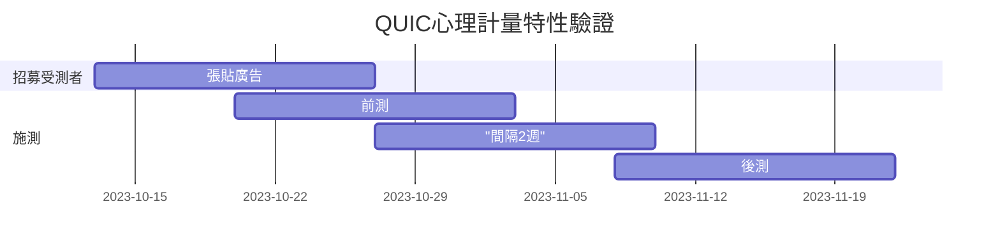

---
{"dg-publish":true,"permalink":"/Projects/QUIC/現況與發展規劃/","title":"現況與發展規劃","tags":["chatgpt","measurement","blog"],"created":"2023-09-05T00:00:00.000Z","updated":"2023-09-27T00:00:00.000Z"}
---

## 現況

已確認QUIC預計用來施測的版本，包含8項核心功能。待10月中旬（預計）IRB通過後開始啟動招募受測者。

# 發展規劃

## 後續時程規劃示意圖

## 心理計量特性驗證

### 參與者

- 預計招募400名參與者
  - 曾使用過ChatGPT或其他大型語言模型聊天機器人服務者
- 招募方法：在網路社群招募，請有意參加者**填寫報名表單**。同時寄信邀請台灣其他ChatGPT相關研究者，或請他們推薦
  - FB ChatGPT交流社群招募
    - [ChatGPT 生活運用](https://www.facebook.com/groups/2152027081656284/)
    - [ChatGPT & OpenAI 中文討論區](https://www.facebook.com/groups/chatgpt2app/)
    - [AI 詠唱者交流（AIGC 人工智慧產製內容）](https://www.facebook.com/groups/aigcstation/)
  - PTT:
    - Q_ary, salary, job
  - Dcard:
    - 省錢版、ChatGPT版
- 預計招募2週，招到**400**人或由主持人決定何時停止招募
    - 若2週未滿300人，則繼續招募2週。

### 流程

- 招募受試者
    - 於FB、PTT、Dcard上張貼招募廣告，
- 篩選以及確認意願
    - 寄email給報名者說明實驗注意事項（包含實驗時間、受試者費用領取方法、同意書簽名以及寄回方式）
- 進行前測
    - 寄送前測連結
    - 前測問卷包含QUIC以及[[tasks and measurements/AI信任問卷\|AI信任問卷]]、[[Projects/QUIC/科技接受模式中文版量表\|科技接受模式中文版量表]]
- 間隔2週
- 進行後測
    - 寄送後測連結（加問地址，用來寄送同意書與領據，需事先知會同意書後寄）

# 已完成

## 驗證表面效度

- 受測者：一半主動招，一半公開招
  - 至少3個學院之大學生或研究生各3位，共9位學生
  - 業界使用者11位，盡可能包含不同的**年紀、教育程度、職業類別**
- 招募的地點
  - [[Projects/QUIC/一般使用者表面效度驗證#^2da32d\|招募文宣]]
  - 經朋友詢問
  - FB社群
  - [ChatGPT 生活運用](https://www.facebook.com/groups/2152027081656284/)
  - [ChatGPT & OpenAI 中文討論區](https://www.facebook.com/groups/chatgpt2app/)
  - [AI 詠唱者交流（AIGC 人工智慧產製內容）](https://www.facebook.com/groups/aigcstation/)
- 方式
  - 線上問卷： <https://www.surveycake.com/s/9QPDz>
  - 以5點量尺（1–5分）判斷問卷的說明是否清楚、題目描述是否可以理解、作答的選項（量尺）是否容易作答
- 需時：2週

## 專家效度驗證