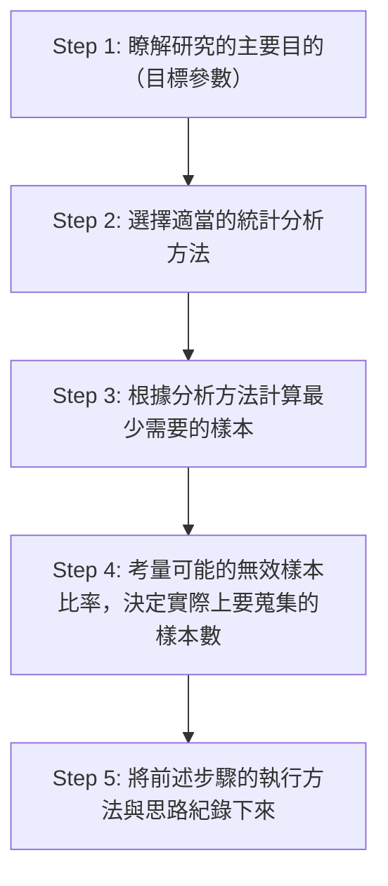

---
{"dg-publish":true,"permalink":"/determining sample size/","title":"如何決定樣本數？","tags":["guideline","statistics"],"created":"2024-02-05T16:18","updated":"2024-02-06T16:24"}
---

## 為什麼要估計樣本數？

估計需要的樣本數是在研究準備過程中很重要的一步，如果在資料開始蒐集之後才想到就來不及了。
- 行政上，樣本估計可以協助達到較佳的資源分配（時間以及金錢）。
- 分析上，樣本估計可以事先評估
    - 對目標母群參數估計的準確程度（描述統計）
    - 對特定效果量的統計檢定力（推論統計）

## 樣本數估計流程

根據Bujang（2021），研究的樣本估計流程包含5個步驟（見上圖）。會寫到步驟5是因為樣本數的估計是研究方法中重要的一環，但目前文獻上不同研究對於樣本數如何估計的描寫方式不盡相同。Bujang（2021）想要提供一個可以讓研究者在撰寫相關段落時有可以依循的步驟。
## 描述統計的樣本數估計

描述統計目標是要估計母群的參數，而這需要有足夠的樣本數才可以得到可信的樣本估計。在計算需要的樣本數時，針對不同的參數（如：平均、發生率）有不同的適用公式（Sapra, 2022）。不同的公式主要的差異在於對於參數的誤差分佈的假設（高斯、或是其他分配）。在計算時有幾個需要考量的參數：
- 研究想要達到的信心程度
    - 90%？95%？99%？由研究者決定。
    - 根據不同的信心程度，再搭配參數的誤差分佈的假設，在計算時需要轉換為相對應的數值（例如若要達到95%信心程度，且假設參數的誤差分佈為標準化常態分佈，則要將95%信心程度轉為$Z$值，也就是1.96）。
- 對估計值的測量精準度或是測量誤差
    - 測量精準度是測量誤差的倒數，是參數估計的可信程度。測量誤差包含了隨機誤差以及系統誤差。
    - 這個值可以是已知工具的測量誤差值（如[[standard error of measurement\|SEM]]），或是研究者可以容許的測量誤差值。
        - 訂定容許的測量誤差值時可以定**絕對誤差值**（例如 2 個測量單位）或是**相對誤差值**（例如參數估計值的3%），視研究的需求而定。
- 預期的平均數、標準差
    - 也就是預期測量樣本會得到的平均數以及標準差。可以從既有的研究報告或是 pilot study 數據獲得。

### 估計平均數所需的樣本數

根據 Sapra（2022, p 85），若想要計算可以達到對母群平均數有可信估計，可以使用以下公式

$$n \ge Z^2\sigma^2/d^2$$
其中，
- $n$為最少需要的樣本數
- $Z$為對應信心程度的$Z$值，例如95%信心程度的$Z$值為1.96。這是因為假設平均數的測量誤差分佈為標準化常態分佈，才會套用$Z$分佈。
- $\sigma$為預期可能得到的標準差
- $d$為測量誤差（要和$\sigma$相同的單位，若是使用相對誤差時要特別注意記得換算）
#### 例1
> [!EXAMPLE] 假設我們想要以問卷估計生成式AI初學者對於「能正確地判斷AI給予的回應是否正確」的自我效能平均分數。而pilot study 的結果其平均為6.1分，標準差為 1.8。在95%的信心水準下，想要對母群平均得到容許的測量誤差為±1分的估計，最少應該蒐集多少樣本數？
> - 代入上述的公式 $n \ge 1.96^2*1.8^2/1^2 = 12.45$
> - 因此，最少需要蒐集13人的樣本

#### 例2
> [!EXAMPLE] 若假設我們想要以問卷估計生成式AI初學者對於「能正確地判斷AI給予的回應是否正確」的自我效能平均分數。而pilot study 的結果其平均為6.1分，標準差為 1.8。在95%的信心水準下，若已知該問卷的測量誤差（SEM%）為17%，最少應該蒐集多少樣本數？
> - 代入上述的公式 $n \ge 1.96^2*1.8^2 /(0.17*6.1)^2 = 11.57$
>     - ※ 這裡使用的是相對誤差（SEM%），故需先計算出誤差值$0.17*6.1 = 1.03$
> - 因此，最少需要蒐集12人的樣本

## 推論統計的樣本數估計

- 需要考量的參數
    - $\alpha$: type I error rate
    - $\beta$: type II error rate
    - effect size

... 細節待補

## 心得

過去在進行樣本數估計時，我所受的訓練都是集中在推論統計，主要考量的是實驗操弄的效果是否能夠被統計方法檢驗出來，對於母群參數估計的準確度或是可信度就沒那麼關心。因為不同組別都是用同樣的方法測量，誤差對所有組別應該都是一樣的。只要樣本數夠大，讓實驗操弄的效果可以顯現即可。這是第一次對於參數估計的準確度或是可信度所需要的樣本數估計有更進一步的認識，值得紀錄。

此外，描述統計中對於n的計算，似乎可以理解為測量誤差跟估計標準誤的比值需要大於信心水準。這個理解從公式來

$$n \ge Z^2\sigma^2/d^2$$
移項之後可以得到
$$\frac{d^2}{\sigma^2}n \ge Z^2$$
而這又可以改寫為
$$\frac{d^2}{\sigma^2/n} = \frac{d^2}{se^2}\ge Z^2$$
也就是
$$\frac{測量誤差}{估計標準誤} \ge Z$$
## 參考文獻

Bujang, M. A. (2021). A Step-by-Step Process on Sample Size Determination for Medical Research. _Malaysian Journal of Medical Sciences_, _28_(2), 15–27. [https://doi.org/10.21315/mjms2021.28.2.2](https://doi.org/10.21315/mjms2021.28.2.2)

De Vet, H., Terwee, C., Mokkink, L., & Knol, D. (2011). Reliability. In _Measurement in Medicine: A Practical Guide_ (Practical Guides to Biostatistics and Epidemiology, pp. 96-149). Cambridge: Cambridge University Press. doi:10.1017/CBO9780511996214.006

Sapra, R. L. (2022). How to Calculate an Adequate Sample Size? In S. Nundy, A. Kakar, & Z. A. Bhutta, _How to Practice Academic Medicine and Publish from Developing Countries?_ (pp. 81–93). Springer Nature Singapore. [https://doi.org/10.1007/978-981-16-5248-6_9](https://doi.org/10.1007/978-981-16-5248-6_9)