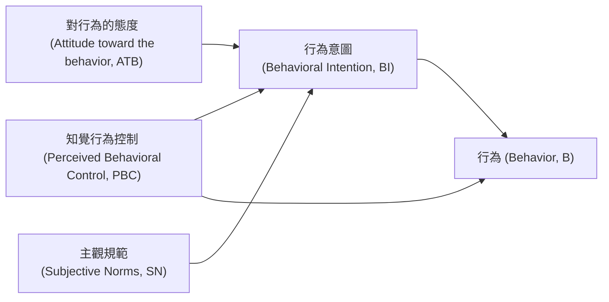

---
{"dg-publish":true,"permalink":"/計畫行為理論/","title":"計畫行為理論","tags":["terms","behavior","motivation","attitude"],"created":"2025-01-20T11:57","updated":"2025-01-20T15:22"}
---

計畫行為理論 (Theory of Planned Behavior, TPB) 是一個被廣泛應用於預測和改變人類行為的理論框架。這個理論指出，行為意圖 (behavioral intention) 是表現某個行為最直接的決定因素，而行為意圖受到三個背景因素的影響：對行為的態度 (attitude toward the behavior)、知覺行為控制 (perceived behavioral control)以及主觀規範 (subjective norm) 。

各因素說明如下：
- 行為意圖：
	- 執行特定行為的動機指標，動機越強越有可能執行該行為。
	- 行為意圖受到對行為的態度、知覺行為控制以及主觀規範。
- 對行為的態度 (attitude toward the behavior)
	- 指個人對執行某個行為的正面或負面評價。是基於對行為結果的信念（behavioral beliefs），即認為執行該行為會帶來哪些好處或壞處。簡言之，
- 知覺行為控制 (perceived behavioral control)
	- 指個人知覺對執行某個行為的主觀難易程度，是一種自我效能（self-efficacy）。包含了對自我決策能力的知覺、對自己取得資訊的能力、自己的經濟能力、醫療資源的可近性、時間、社會資源、要執行的行為程序複雜度、文化或宗教因素等。
	- 知覺行為控制會直接影響行為，以及間接透過行為意圖影響行為。
- 主觀規範 (subjective norm)
	- 指個人主觀感受到的社會壓力，源自兩種信念
		- 重要他人（家人、朋友、上司，視行為情境而定）可能贊成自己執行該行為的信念
		- 重要他人可能執行該行為的信念

---

## 參考文獻

Ajzen, I. (1991). The theory of planned behavior. _Organizational Behavior and Human Decision Processes_, _50_(2), 179–211. [https://doi.org/10.1016/0749-5978(91)90020-T](https://doi.org/10.1016/0749-5978(91)90020-T)

Ajzen, I. (2011). The theory of planned behaviour: Reactions and reflections. _Psychology & Health_, _26_(9), 1113–1127. [https://doi.org/10.1080/08870446.2011.613995](https://doi.org/10.1080/08870446.2011.613995)

Ajzen, I. (2020). The theory of planned behavior: Frequently asked questions. _Human Behavior and Emerging Technologies_, _2_(4), 314–324. [https://doi.org/10.1002/hbe2.195](https://doi.org/10.1002/hbe2.195)